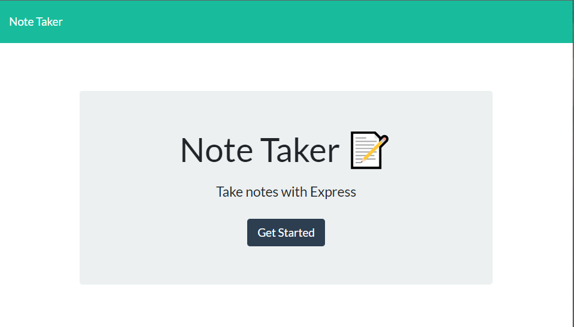
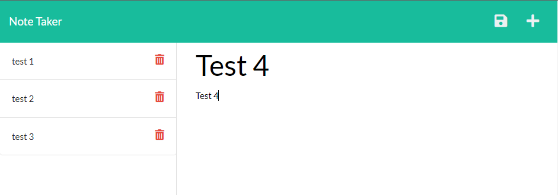

# Note Taker with Express.js

## Description
This application is used for creating and saving notes. I learned a lot during the process about creating routes, and how to access the backend.

## How to use
Make sure you have node installed. Open the project. Find the "note-app" folder and open it in your terminal. Type "npm i" then "node server.js" to start the server. Naviagte to your browser and type "[localhost](http://localhost:3001/)"

## User Story
AS A small business owner 
I WANT to be able to write and save notes 
SO THAT I can organize my thoughts and keep track of tasks I need to complete.

## Acceptance Criteria
GIVEN a note-taking application 
WHEN I open the Note Taker 
THEN I am presented with a landing page with a link to a notes page 
WHEN I click on the link to the notes page 
THEN I am presented with a page with existing notes listed in the  left-hand column, plus empty fields to enter a new note title and the note’s text in the right-hand column 
WHEN I enter a new note title and the note’s text 
THEN a Save icon appears in the navigation at the top of the page 
WHEN I click on the Save icon 
THEN the new note I have entered is saved and appears in the left-hand column with the other existing notes 
WHEN I click on an existing note in the list in the left-hand column 
THEN that note appears in the right-hand column 
WHEN I click on the Write icon in the navigation at the top of the page 
THEN I am presented with empty fields to enter a new note title and the note’s text in the right-hand column

## Screenshots
Landing Page

Notes Page

## Deployment

## Contact

- [GitHub](https://github.com/brackenluke 'GitHub')
